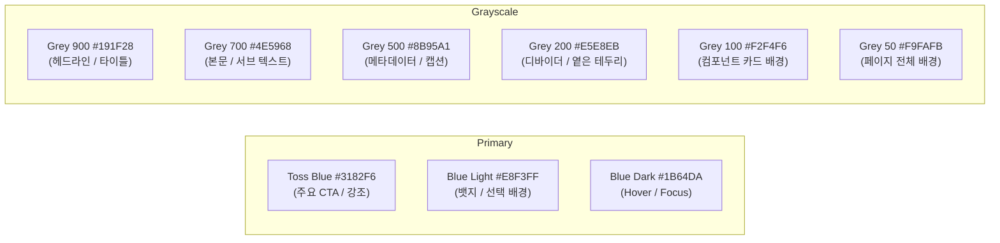
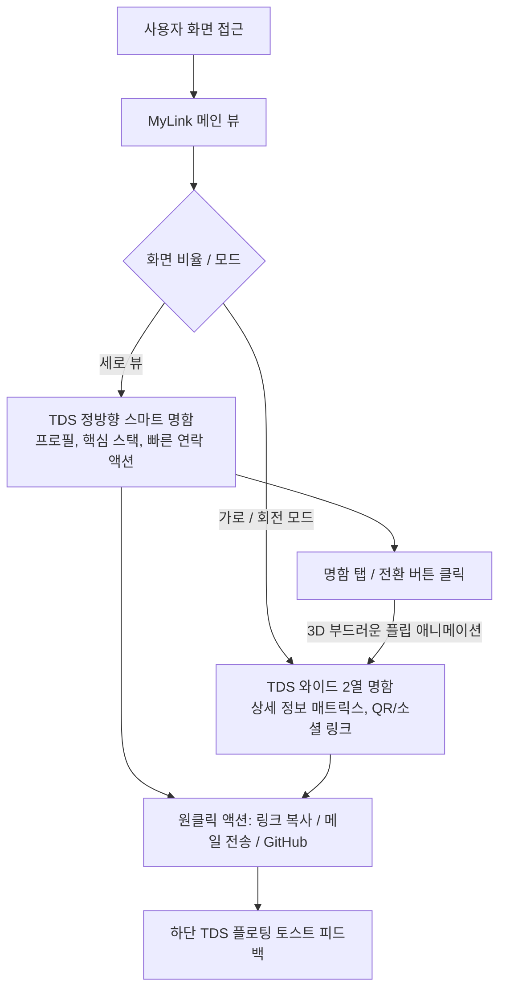

# 📐 MyLink - 시스템 설계 문서 (DESIGN.md)
### 🏛️ Toss Design System (TDS) & shadcn/ui 기반 인터랙티브 디지털 명함/링크 허브

---

## 1. 개요 (Overview)

### 1.1 프로젝트 정의
**MyLink**는 **토스 디자인 시스템(Toss Design System, TDS)** 의 핵심 철학인 **직관성(Simplicity), 명확성(Clarity), 유려한 인터랙션(Fluid Interaction)** 을 바탕으로 구축된 **모던 디지털 명함 및 개인 링크 허브 웹 애플리케이션**입니다.  
과도한 시각적 노이즈를 배제하고 정보의 본질에 집중하며, 누구나 한눈에 이해하고 부드럽게 소통할 수 있는 프리미엄 사용자 경험을 제공합니다.

### 1.2 핵심 가치 (Core Values)
- **Extreme Simplicity (극도의 단순함)**: 복잡한 그래픽 장식을 덜어내고, 여백과 폰트 위계만으로 콘텐츠를 명료하게 전달합니다.
- **Toss Identity (토스 감성 디자인)**: 시그니처 토스 블루(`Toss Blue #3182F6`), 섬세한 그레이스케일 계층, 넉넉한 라운딩(`rounded-2xl` ~ `rounded-3xl`)을 적용합니다.
- **Fluid & Tactile Motion (쫀득한 인터랙션)**: 터치 및 클릭 시 자연스럽게 반응하는 토스 특유의 스케일 인터랙션(`active:scale-[0.98]`)과 부드러운 3D 뷰 전환을 지원합니다.
- **Accessible & Scalable (확장 가능한 구조)**: WAI-ARIA 접근성 표준을 준수하는 shadcn/ui 프리미티브 컴포넌트와 단일 프로필 설정(`PROFILE_CONFIG`) 구조를 채택합니다.

---

## 2. 기술 스택 및 아키텍처 (Tech Stack & Architecture)

### 2.1 기술 스택 (Tech Stack)

| 계층 | 기술 | 버전 / 비고 |
| :--- | :--- | :--- |
| **Framework** | Next.js (App Router) | `16.3.4` (Turbopack) |
| **Core Library** | React | `19.2.8` |
| **Language** | TypeScript | `^5.0` (Strict Mode) |
| **Styling** | Tailwind CSS | `v4.0` (@tailwindcss/postcss) |
| **Design System** | **Toss Design System (TDS)** | 토스 컬러 토큰, 타이포그래피, 마이크로 인터랙션 규격 |
| **UI Library** | **shadcn/ui** | Base UI + Lucide Icons 기반 접근성 프리미티브 |
| **Typography** | Pretendard / Sans-serif | 고가독성 모던 한글/영문 시스템 폰트 스케일 |
| **Deployment** | Vercel / Static Hosting | 무상태(Stateless) 클라이언트 렌더링 최적화 |

### 2.2 디렉터리 구조 (Directory Structure)

```text
workspace/
├── docs/
│   └── DESIGN.md                  # 본 TDS 기반 시스템 설계 문서
└── mylink/
    ├── docs/
    │   └── PRD_Linktree_Clone_kr.md # 제품 요구사항 정의서 (PRD)
    ├── public/                    # 정적 에셋 (SVG 아이콘 등)
    ├── src/
    │   ├── app/
    │   │   ├── globals.css        # 전역 스타일, TDS 컬러 토큰, shadcn CSS 변수
    │   │   ├── layout.tsx         # 루트 레이아웃 및 폰트/메타데이터 설정
    │   │   └── page.tsx           # 디지털 명함/프로필 메인 컴포넌트
    │   ├── components/
    │   │   └── ui/                # shadcn/ui 컴포넌트 (button.tsx, card.tsx 등)
    │   └── lib/
    │       └── utils.ts           # cn() 등 shadcn 공통 유틸리티
    ├── components.json            # shadcn/ui 설정 파일
    ├── package.json               # 의존성 및 스크립트
    ├── tsconfig.json              # TypeScript 설정 (@/* alias)
    └── postcss.config.mjs         # PostCSS 설정
```

---

## 3. UI/UX 디자인 시스템: Toss Design System (TDS) 가이드라인

### 3.1 컬러 팔레트 (TDS Color Tokens)

TDS의 핵심은 눈에 편안한 그레이 배경 위에 신뢰감을 주는 포인트 블루와 명확한 텍스트 위계입니다.



| 토큰명 | Hex 코드 | 역할 및 사용처 |
| :--- | :--- | :--- |
| **`toss-blue`** | `#3182F6` | 메인 브랜드 컬러, 주요 CTA 버튼, 활성 상태 아이콘 |
| **`toss-blue-light`** | `#E8F3FF` | 포인트 태그/뱃지 배경, 서브 강조 요소 |
| **`toss-blue-dark`** | `#1B64DA` | 버튼 인터랙션 호버 상태 |
| **`grey-900`** | `#191F28` | 가장 강조되는 굵은 이름/타이틀 텍스트 |
| **`grey-800`** | `#333D4B` | 섹션 소제목, 주요 텍스트 |
| **`grey-700`** | `#4E5968` | 일반 본문 텍스트, 보조 설명 |
| **`grey-500`** | `#8B95A1` | 부가 정보, 메타데이터, 타임스탬프 |
| **`grey-200`** | `#E5E8EB` | 카드 구분선, 섬세한 경계 테두리 |
| **`grey-100`** | `#F2F4F6` | 버튼 기본 배경, 카드형 컨테이너 배경 |
| **`grey-50` / Page Bg** | `#F9FAFB` | 전체 페이지 기본 배경 (부드러운 오프화이트) |
| **`white`** | `#FFFFFF` | 메인 명함 카드 서피스, 플로팅 엘리먼트 |
| **`success`** | `#04B05C` | 온라인/작업 가능 상태 뱃지 |

> **다크 모드 (Toss Dark Mode)** 대응:
> - Background: `#101012`
> - Card Surface: `#1C1C1E` / Elevated `#2C2C2E`
> - Text: Primary `#FFFFFF`, Secondary `#A6A6AA`

---

### 3.2 타이포그래피 (TDS Typography Hierarchy)

Pretendard 및 시스템 산세리프 폰트를 사용하여 맑고 또렷한 텍스트 리듬을 구현합니다.

| 스타일 레벨 | 크기 / Line Height | Font Weight | 용도 |
| :--- | :--- | :--- | :--- |
| **Display / Title 1** | `26px` ~ `30px` (1.3) | **Bold (700)** | 사용자 이름, 핵심 헤드라인 |
| **Title 2** | `20px` ~ `22px` (1.35) | **Bold (700)** | 섹션 제목, 카드 헤더 |
| **Subtitle / Body 1** | `15px` ~ `16px` (1.45) | **Semibold (600)** | 직무(Role), 주요 링크 제목, 버튼 텍스트 |
| **Body 2** | `13px` ~ `14px` (1.5) | **Medium (500)** | 소속, 상세 소개 문구(Bio) |
| **Caption** | `11px` ~ `12px` (1.4) | **Regular / Medium** | 메타데이터, 보조 태그, 바코드/UID |

---

### 3.3 컴포넌트 원칙 (TDS Component Principles)

1. **넉넉한 라운딩 (Generous Border Radius)**
   - 컨테이너 카드: `rounded-3xl` (`24px`) 또는 `rounded-2xl` (`16px`)
   - 버튼 및 인터랙티브 엘리먼트: `rounded-xl` (`12px`) ~ `rounded-2xl` (`16px`)
   - 뱃지/칩: `rounded-full` (알약 스타일)

2. **직관적인 카드 & 버튼 (Toss Style Buttons & Cards)**
   - **Primary Action (토스 블루 버튼)**:
     - 견고한 배경색(`bg-[#3182F6] hover:bg-[#1B64DA] text-white`)
     - 두툼한 터치 영역(`h-12` ~ `h-14` 또는 최소 `h-11`)
     - 터치 즉시 피드백을 주는 **스케일 모션 (`active:scale-[0.98] transition-transform`)**
   - **Secondary / Ghost Action**:
     - 연한 그레이 배경(`bg-[#F2F4F6] text-[#333D4B] hover:bg-[#E5E8EB]`)
     - 테두리를 억지로 강조하지 않고 배경 명도 차이로 자연스럽게 구분
   - **Card Surface**:
     - 플랫하고 깨끗한 화이트 배경 + 미세한 그림자(`shadow-sm` or `shadow-[0_4px_24px_rgba(0,0,0,0.04)]`)

3. **플로팅 알약 토스트 (TDS Toast)**
   - 하단 중앙에 부드럽게 떠오르는 다크 차콜 알약 캡슐(`bg-[#191F28]/95 text-white backdrop-blur rounded-full px-5 py-3 shadow-xl`)
   - 명확하고 친절한 문구 ("링크가 복사되었어요", "이메일 주소를 복사했어요")

4. **친절하고 명료한 마이크로카피 (Toss Tone of Voice)**
   - 딱딱한 기계적 안내문 대신 사람에게 직접 건네는 대화형 어조 사용.
   - 예: `명함 복사` → `내 명함 링크 복사하기`, `UID // CW-CSE-2026` 등

---

## 4. 시스템 구조 및 사용자 인터랙션 설계

### 4.1 상태 모델 및 3D 플립 구조
토스 디자인 시스템의 간결한 비주얼 위에 인터랙티브 3D 명함 카드 인터랙션을 결합합니다:



### 4.2 프로필 설정 규격 (`PROFILE_CONFIG`)
유지보수가 용이하도록 개인 프로필 데이터는 독립된 설정 객체로 격리 관리합니다.

```typescript
export const PROFILE_CONFIG = {
  name: '정유건',
  nameEn: 'Ugeon Jung',
  role: 'Software Engineer',
  affiliation: '청운대학교 컴퓨터공학과',
  bio: '아이디어를 견고한 제품으로 실현하는 엔지니어',
  status: '협업 및 새로운 기회에 열려있어요',
  email: 'ugeon0361@gmail.com',
  githubUrl: 'https://github.com/u-gun',
  techStack: ['Java', 'C++', 'SQL', 'TypeScript', 'Next.js'],
  themeColor: '#3182F6', // Toss Blue
};
```

---

## 5. shadcn/ui 기반 컴포넌트 아키텍처

TDS의 규격을 충족하기 위해 shadcn/ui의 설정을 다음과 같이 동기화합니다:

- **Button (`@/components/ui/button.tsx`)**:
  - `default`: Toss Blue 배경 + 라운드 모서리 + 햅틱 느낌의 `active:scale-[0.98]`
  - `secondary`: Grey 100 배경 + Grey 800 폰트
  - `outline`: Grey 200 보더 + Hover Grey 50
- **Toast / Sonner**:
  - TDS 스타일의 하단 플로팅 라운드 토스트 메시지
- **Card (`@/components/ui/card.tsx`)**:
  - `rounded-3xl` 반경, 패딩 24px, 은은한 서피스 음영
- **Badge / Chip**:
  - 둥근 알약형태의 기술 스택 칩 (`bg-[#E8F3FF] text-[#3182F6] font-semibold`)

---

## 6. 향후 확장 로드맵 (Future Roadmap)

1. **TDS 기반 다크 모드 / 라이트 모드 원클릭 토글**: 시스템 설정에 맞춘 자동 전환 및 수동 토글 지원.
2. **동적 QR 코드 모달**: 오프라인에서 즉시 스캔 가능한 토스 스타일의 모달 팝업 제공.
3. **vCard (.vcf) 스마트폰 연락처 저장**: 연락처 앱과 즉시 동기화되는 원클릭 저장 기능.
4. **링크 통계 미니 대시보드 (Analytics Preview)**: 링크 클릭 수, 방문자 수를 토스 금융 그래프 스타일로 시각화.
